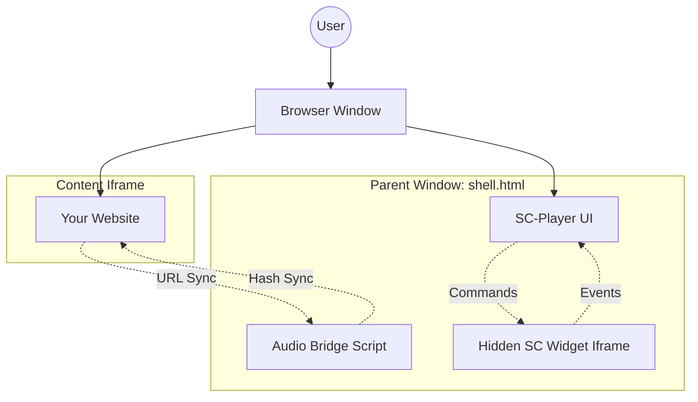
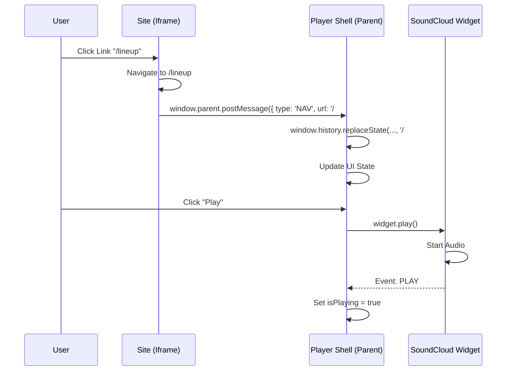

# Technical Documentation

This document explains the architecture and underlying mechanisms of the **Hide Embedded SC Player**.

---

## 1. The Persistence Architecture (The "Shell Pattern")

The core problem of web audio is that it stops when the `window` object is destroyed (i.e., when a user navigates to a new page). To solve this, we use a "Shell Architecture":

### Architecture Diagram



### State Synchronization Flow



1. **Parent Window (`shell.html`):** This is the permanent home of the audio player. It never reloads.
2. **Content Iframe:** Your actual website is loaded inside an `<iframe>`. Navigation clicks change the URL *inside* this frame, leaving the parent window untouched.
3. **Hidden Widget Iframe:** A second, hidden iframe loads the SoundCloud Widget. This allows us to use the SoundCloud API without showing their default player UI.

### URL Synchronization & Deep Linking

To prevent users from being "trapped" on the homepage (since the parent URL doesn't change when the iframe navigates), the shell implements a **Hash-based Sync**:

- **Iframe → Parent:** When the iframe navigates to `/lineup`, the shell updates the parent URL to `yoursite.com/#/lineup`.
- **Parent → Iframe:** If a user visits `yoursite.com/#/tickets`, the shell reads the hash on load and tells the iframe to navigate directly to `/tickets`.
- **History API:** We use `window.history.replaceState` to keep the hash updated without polluting the browser history with hundreds of sub-page entries.

---

## 2. SoundCloud Widget API Integration

The component automatically manages the SoundCloud Widget API:

1. **Script Injection:** On mount, it checks for `window.SC`. If missing, it dynamically injects the `https://w.soundcloud.com/player/api.js` script and initializes the widget once loaded.
2. **Auto-Configuration:** If `scEmbedUrl` is not provided, the component automatically constructs a valid embed URL using the `playlistId` from your data.

### Key Events

- `READY`: The widget is loaded and we can start sending commands (load, play, seek).
- `SOUND_CHANGE`: Triggered when the track finishes or a new one is loaded. We use this to update our local metadata (Artist, Title).
- `PLAY`/`PAUSE`: We sync our UI state to these events so the Play/Pause button always reflects the actual playback state.

### Metadata Management

Instead of fetching metadata from the SoundCloud API at runtime (which requires a Client ID and can be slow), we bundle track metadata (ID, title, artist, duration, artwork, permalink) in a local `playlists.json`. This ensures:

1. **Instant UI Updates:** No "Loading..." states for track titles.
2. **Stability:** The player works even if the SoundCloud API metadata endpoints are slow.
3. **SEO:** Track lists are indexable by search engines because they are part of the static HTML/JSON.

---

## 3. Theming & Customization

The player uses a **CSS-First** theming approach. All visual properties are mapped to CSS Custom Properties (Variables):

```css
.sc-player {
  --scp-bg: #1a1a24;
  --scp-accent: #1a1a1a;
  /* ... */
}
```

When you provide a `theme` object in React or `PLAYER_CONFIG` in Standalone, the player simply updates these variables on the root element. This allows you to override styles in your own CSS without touching the library code.

---

## 4. State Persistence

To provide a premium experience, the player persists its state in `localStorage`:

- **Current Playlist:** Remembers if the user was listening to "2024" or "2025".
- **Current Track Index:** Remembers which song they were on.
- **Playback Progress:** Remembers the exact second they stopped.

When the user returns to the site or refreshes the page, the player silently reloads the track and seeks to the saved position.

---

## 5. Standalone vs. React

- **React Implementation:** Uses `useEffect` and `useCallback` for reactive state management. Best for apps where the player is part of the application state.
- **Standalone Implementation:** Uses a self-invoking function and direct DOM manipulation. It is designed to be "invisible" to the developer—just include the script and it works.

---

## Maintenance

### Adding New Tracks

1. Add the track data to `src/lib/playlists.json`.
2. If using the Standalone version, sync the data:
  
    ```bash
    # From the project root
    node -e "const fs = require('fs'); const data = fs.readFileSync('src/lib/playlists.json', 'utf8'); fs.writeFileSync('standalone/playlists.js', 'window.PLAYER_PLAYLISTS = ' + data);"

    ```bash
    node -e "const fs = require('fs'); const data = fs.readFileSync('src/lib/playlists.json', 'utf8'); fs.writeFileSync('standalone/playlists.js', 'window.PLAYER_PLAYLISTS = ' + data);"
    ```
